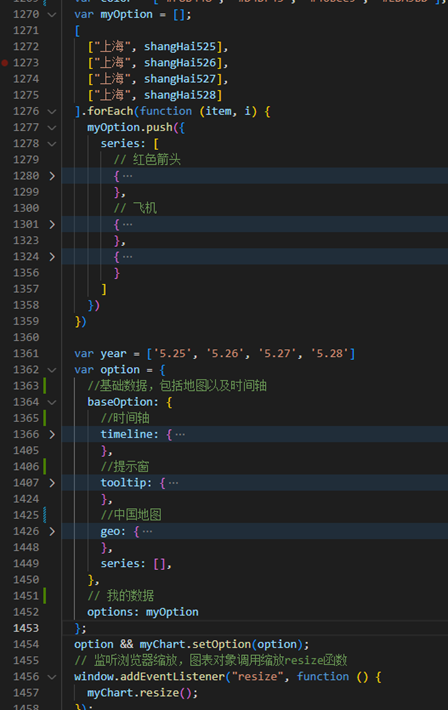

<center><b><font size='6'>2022年上海疫情爆发期间交通数据可视化分析
<center>《数据可视化》课程期末项目报告-选题：地理数据可视化

[TOC]

# 1.0 项目简介

> 本项目由谢yc，卜j 共同完成，本 README.me 只描述本人工作内容

上海各高校自三月中上旬开始封校管理，并进行线上教学。高校人员密集，聚集性新冠病例频出，加之封校封楼导致日常生活、外出就医等方面有诸多不便，因此大学生返乡意愿格外强烈。五月疫情逐渐好转后，上海各高校逐渐放开申请离校返乡的通道，但如何返乡又成为了新的难题。比如买好机票后被临时通知航班取消，又比如找不到前往机场、火车站的公共交通，只能步行或骑自行车。因此，我们决定对上海疫情爆发期间的交通数据进行可视化分析，以航班数据可视化为主要切入点，同时分析直达机场各航站楼的公交数据。

# 2.0 数据简介

## 2.1 航线数据

主要来自上海机场公司的官网以及飞常准APP。昨天、今天、明天三天的详细航班数据可在上海机场官网可以获；而上海近三年航班数据（只包含执行、取消、延误的航班数量）由飞常准APP获取。


## 2.2 公交路线数据

来自上海机场官网机场交通页面。


## 2.1 项目流程

- 数据的采集部分，以搜集可能用于项目的数据为目标，汇总整合，
- 采用上海机场官网和飞常准APP的航线数据绘制航线页面，采用上海机场官网的机场公交交通部分数据绘制公交路线页面。

# 3.0 数据处理

## 3.1 航线数据

获取航线初始站和目的站的经纬度信息，如下图所示：


## 3.2 公交路线数据

### 3.2.1 公交路线上点的经纬度数据

在公交路线可视化这部分，是将地图上公交路线上的每个点渲染出来产生的效果，也就是说需要用到路线上每一个站点到站点之间每个点的经纬度。这部分数据的预处理工作量就很大了，因为我们只有公交途径站点的名称，并没有对应的路线经纬度数据。


我们先要去把所有公交途径站点的经纬度信息获取下来，然后再获取途径站点间路线的经纬度数据。我们先找到一个百度地图的网页，然后分析里面的源码，发现有一个变量就是我们需要的数据，接着把它打印出来，再复制到json文件中。


以这种操作循环进行下去，知道所有站点间的路线数据都拿下来。

### 3.2.2 词云图数据

接着是梳理所有途径站的名称，得到第二块数据用于制作词云图。

# 4.0 可视化设计

## 4.1 公交路线图

可视化的意义在于可以更加直观地估计各公交路线离自己的距离，方便选择公交路线


### 4.1.1 公交路线

每一条亮色的线就是一条公交路线，每一条公交路线都精确地落在了地图的具体街道上。这些路线是以虹桥1号航站楼、虹桥2号航站楼、浦东1号航站楼、浦东2号航站楼为起点的29路公交路线。当地图被放大后，亮线依然可以准确地显示在街道之上，不会产生偏差，可以给用户直观准确的视觉体验。

### 4.1.2 动态效果

每条亮线上都会有高亮的点运动的效果，运动的方向就是公交前进的方向。将整个页面由静态转换成动态，避免用户产生视觉疲劳，同时将公交前进方向可视化，能够帮助用户理解公交路线。

### 4.1.3 公交路线途径站点的词云图

显示了所有公交路线途径站点的词云图。这个词云显示可以帮助了解到哪些站是交通枢纽，比如说这个航程园，就有3-4路公交线同时经过，那他就应该是个交通枢纽，可以前往换乘或者在疫情特殊时期避开人群。


## 4.2 航线部分

效果是在动态背景上绘制了一张中国地图，然后随着时间轴的节点变化，渲染出节点那天的航站信息。


### 4.2.1 动态背景

旋转的网格图和箭头可以让背景可以给到更加活泼的视觉体验

### 4.2.2 中国地图

中国地图可以移动，缩放，鼠标移动后会高亮，并且显示省份名称

### 4.2.3 航线+时间轴

每天的航线数据会随着时间轴节点的改变而改变，小飞机图标和红点的搭配结合，可以模拟一种飞机后有彩带的效果，丰富好看。

# 5.0 编程实现 (不用堆砌所有代码，仅介绍核心的代码内容)

## 5.1 中国地图航线+时间轴

先将每天的航线信息封装成了一个数组，然后和时间轴的对应节点绑定，将所有的航线信息放到 myOption 数组当中。

时间轴的 option 配置为 object 对象

```js
var option = {
	// 基础数据，包括地图时间轴
	baseOption:{},
	// 我的航线和节点绑定的数据
	option: myOption
}
```

再渲染出来，就可以实现地图上的航班信息随着时间轴的改变而改变的效果。这边的航线部分就是由小飞机以及红点构成，飞机是自己导入的图片。




## 5.2 动态背景

绘制旋转的网格图，导入网格照片，然后给照片自定义一个顺时针旋转函数

旋转箭头：导入两个箭头，将箭头控制在地球的边缘位置，添加逆时针旋转函数

以旋转的网格图为例：

```less
  .map2 {
    background: url(../images/grid.png);
    animation: rotate1 15s linear infinite;
    opacity: 0.6;
  }
  @keyframes rotate1 {
    form {
      transform: translate(-50%, -50%) rotate(0deg);
    }
    to {
      transform: translate(-50%, -50%) rotate(360deg);
    }
  }
```

## 5.3 公交路线

### 5.3.1 公交路线

对初步数据处理过后的 lines-bus.json 文件中数据再次处理成程序需要的数据格式，返回一个大数组，里面分别是一个个小数组，分别对应一条公交路线。这里先使用了 map 函数遍历 busLines 内的每个数组元素，将每个数组元素都整合成 points 的形式，最后每个 busLines 元素会返回一个 object 对象，有属性

```js
{
	coords: points //公交路线上所有点的经纬度坐标
	lineStyle:{} // 渲染公交路线的样式
}
```

最后返回一个大数组 busLines[]


### 5.3.2 动态效果

线的效果需要赋予一个 slient = true；动态效果，需要删除 slient 属性，赋予动态效果 effect 对象


## 5.4 公交途径站词云图

进入网站：`https://www.wordclouds.com/`

点击 Shape 选择词云的地图 maps


在 word list 中编辑要生成词云的单词集合，weight 表示单词的权重大小


# 6.0 运行环境配置及测试

## 6.1 环境配置

### 6.1.1 桌面端运行源文件

windows10 + vscode1.68.1 运行。vscode 内下载插件 live server ，下载完成后，在 index.html 文件内右键点击 open with livesever 或者在 index.html 文件内按下快捷键 Alt + L + O 即可显示效果网页

## 6.2 使用技术

1. flex

   弹性布局，在不同的屏幕尺寸和设备下可预测地展现出来，最大限度地填充可用空间。

   - 在不同方向排列元素
   - 重新排列元素的显示顺序
   - 更改元素的对齐方式
   - 动态地将元素装入容器

2. less

   一门 css 预处理语言，扩充了 css，增加了如变量、混合(mixin)、函数等功能，让
    css 更容易维护、方便制作主题、扩充。可以运行在 Node 或浏览器端。

3. jquery

   js 的一个库，封装了常用的 js，代码简洁。

4. rem

   css 的单位，本质是等比缩放，一般基于宽度，举个例子：

   假设我们将屏幕宽度平均分成100份，每一份的宽度用x表示，x = 屏幕宽度 / 100，如果将x作为单位，x前面的数值就代表屏幕宽度的百分比

   `p {width: 50x} /* 屏幕宽度的50% */ `

   如果想要页面元素随着屏幕宽度等比变化，我们需要上面的x单位，不幸的是css中并没有这样的单位，幸运的是在css中有rem，通过rem这个桥梁，可以实现神奇的x

5. echarts

   百度开源的 js 图表库，支持多种形式的可视化图表展示，支持多图表、组件的联动和混搭展现。
